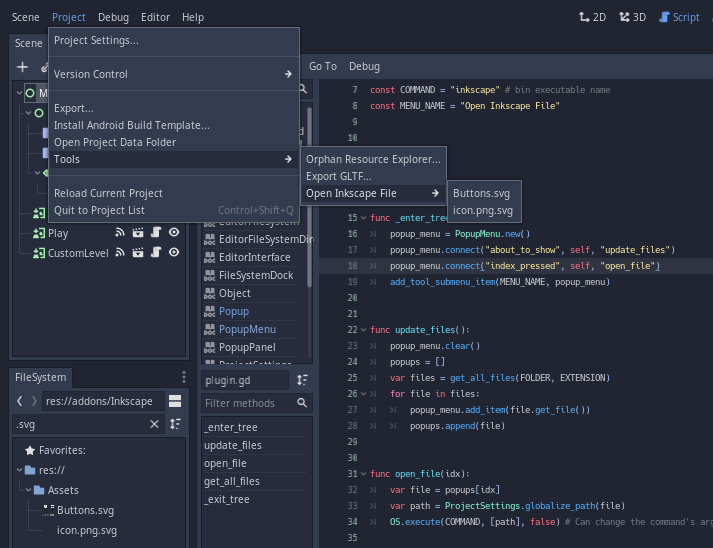

# ExternalAppOpener

Searches the file system recursively for files with a specific extension, then runs a shell command to open that file in an external app.
By default I have set it to open svg files in inkscape.

## How to use

1. Add the plugin to your project and enable it.
2. Edit the constants in plugin.gd
3. Find files under Project>Tools>{Tool Name}

